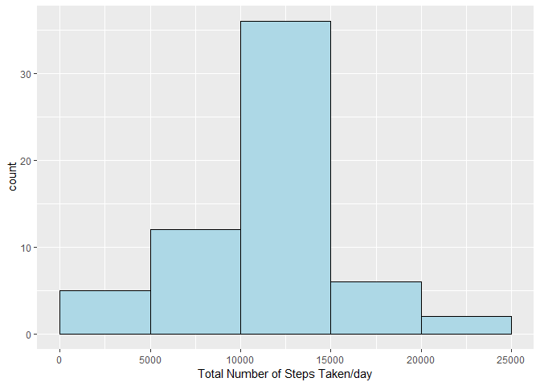

## Loading and preprocessing the data

Reading the data from Cloned Repository from GitHub(*RepData_PeerAssessment1*). Before Loadin and preprocessing the data, needed packages will be loaded `library(dplyr)`.


```r
library(dplyr)
```

```
## 
## Attaching package: 'dplyr'
```

```
## The following objects are masked from 'package:stats':
## 
##     filter, lag
```

```
## The following objects are masked from 'package:base':
## 
##     intersect, setdiff, setequal, union
```

1. Load the data (i.e. read.csv())

  *Set the working directory to the Cloned directory from Github. Unzip the File and Read the file using `read.csv`*

2. Process/transform the data (if necessary) into a format suitable for your analysis

  *Storing the read dataset to activity data frame*


```r
setwd("C:/Users/r.pratap.singh/Desktop/JohnHopkins/RepData_PeerAssessment1")

dwfile <- "activity.zip"
unzip(dwfile)
activity <- read.csv("activity.csv")
```

## What is mean total number of steps taken per day?

*For this part of the assignment, you can ignore the missing values in the dataset.*

1. Calculate the total number of steps taken per day

   - From **activity** dataframe all *NA* values are filtered out using `!is.na()`.
   - Select all Columns except interval.
   - Grouping on **date** column with summarizing the sum on **Steps** Column.
   - Result stored in the `activity_tt_steps` data frame.


```r
activity_tt_steps <- activity %>%
  filter(!is.na(steps)) %>%
  select(-interval) %>%
  group_by(date) %>%
  summarise_all(funs(sum))
```

2. If you do not understand the difference between a histogram and a barplot, research the difference between them. Make a histogram of the total number of steps taken each day

   - Use the ggplot to generate the histogram on **activity_tt_steps** data frame
   - breaks the sequence by 5000.
   

```r
library(ggplot2)

ggplot(activity_tt_steps, aes(x=steps)) +
  geom_histogram(breaks=seq(0, 25000, by=5000), fill = "light blue", col="black") + 
  xlab("Total Number of Steps Taken/day")
```

<!-- -->

3. Calculate and report the mean and median of the total number of steps taken per day

   - Mean of the total number of steps taken per day using **activity_tt_steps** data frame
   - Median of the total number of steps taken per day **activity_tt_steps** data frame


```r
round(mean(activity_tt_steps$steps))
```

```
## [1] 10766
```

```r
median(activity_tt_steps$steps)
```

```
## [1] 10765
```

## What is the average daily activity pattern?

1. Make a time series plot (i.e. type = “l”) of the 5-minute interval (x-axis) and the average number of steps taken, averaged across all days (y-axis)

   - From **activity** dataframe all *NA* values are filtered out using `!is.na()`.
   - Select all Columns except date
   - Grouping on **Interval** column with summarizing the sum on **Steps** Column.
   - Result stored in the `activity_five` data frame.
   - Use the base plot to generate the Plot on **activity_five** data frame


```r
activity_five <- activity %>%
  filter(!is.na(steps)) %>%
  select(-date) %>%
  group_by(interval) %>%
  summarise_all(funs(sum))

plot( steps ~ interval, data = activity_five, xlab = "5 min Interval", 
     ylab = "Avg. No. Of steps averaged across",
     main = "Time series of 5 min plot",  
     col="blue", lwd=2, lty= 1, type="l")
```

<!-- -->

2. Which 5-minute interval, on average across all the days in the dataset, contains the maximum number of steps?
   `which.max(activity_five$steps)` *extracts the position and refrencing it on activity_five dataframe obtains the Maximum number of steps*
   

```r
activity_five[which.max(activity_five$steps),]$interval
```

```
## [1] 835
```

## Imputing missing values

Note that there are a number of days/intervals where there are missing values (coded as NA). The presence of missing days may introduce bias into some calculations or summaries of the data.

1. Calculate and report the total number of missing values in the dataset (i.e. the total number of rows with NAs)
   **Below code will report the total number of rows with NA values.**


```r
sum(is.na(activity))
```

```
## [1] 2304
```

2. Devise a strategy for filling in all of the missing values in the dataset. The strategy does not need to be sophisticated. For example, you could use the mean/median for that day, or the mean for that 5-minute interval, etc.

   **For solving this, we're going to replace the NA's by mean for that 5-minute interval**
   
   - All missing values are stored in `activity_missing` dataframe.
   - All Non-Missing values we taken out and grouped on **Interval** taking the mean.
   - All means are rounded by using `round` function.
   - Storing it in the `activity_repl` dataframe.
   - **Merge** the `activity_missing` and `activity_repl` dataframe on **Interval** Column.
   - Store the Merge dataframe in to `activity_filled`.
   - `activity_filled` dataframe contains all the missing values replaced by mean of that interval.
   - `activity_non_missing` dataframe created to store all non-missing values.
   - Column names of `activity_non_missing` dataframe is used to rename the columns of `activity_filled` dataframe.


```r
activity_missing <- activity %>%
  filter(is.na(steps))

activity_repl <- activity %>%
  filter(!is.na(steps)) %>%
  select(-date) %>%
  group_by(interval) %>%
  summarise_all(funs(mean))

activity_repl$steps <- round(activity_repl$steps)                

activity_filled <- merge(activity_missing, activity_repl, by="interval")

activity_filled <- activity_filled %>%
    select(steps.y, date, interval)

activity_non_missing <- activity %>%
  filter(!is.na(steps))

colnames(activity_filled) <- colnames(activity_non_missing)
```

2. Create a new dataset that is equal to the original dataset but with the missing data filled in.

   **New Dataframe `activity_replaced_missing` created using `rbind` on the Non-missed values from original Dataframe (stored in `activity_non_missing`) and missing values dataframe replaced by mean of that interval `activity_filled`**
   
   Sort the dataframe on date column and interval column in ascending Order.
   

```r
activity_replaced_missing <- rbind(activity_non_missing , activity_filled)
activity_replaced_missing <- arrange(activity_replaced_missing, date, interval)
```

3. Make a histogram of the total number of steps taken each day and Calculate and report the mean and median total number of steps taken per day. Do these values differ from the estimates from the first part of the assignment? What is the impact of imputing missing data on the estimates of the total daily number of steps?

   - Creation of Histogram for the total number of steps taken each day.
   

```r
activity_tt_replaced_missing <- activity_replaced_missing %>%
  select(-interval) %>%
  group_by(date) %>%
  summarise_all(funs(sum))

library(ggplot2)

ggplot(activity_tt_replaced_missing, aes(x=steps)) +
  geom_histogram(breaks=seq(0, 25000, by=5000), fill = "light blue", col="black") + 
  xlab("Total Number of Steps Taken/day")
```

<!-- -->

   - mean of the total number of steps taken per day.
   

```r
# mean of the total number of steps taken per day
round(mean(activity_tt_replaced_missing$steps))
```

```
## [1] 10766
```

   - Median of the total number of steps taken per day.


```r
# Median of the total number of steps taken per day
median(activity_tt_replaced_missing$steps)
```

```
## [1] 10762
```

### **Mean doesn't get changed and we observe 3 unit change in Median that might be caused because of Rounding of imputed values. **

## Are there differences in activity patterns between weekdays and weekends?

   For this part the weekdays() function may be of some help here. Use the dataset with the filled-in missing values for this part.

1. Create a new factor variable in the dataset with two levels – “weekday” and “weekend” indicating whether a given date is a weekday or weekend day.

  - Obtain the Weekdays using R `weekdays()` Function. 
  - Added new Column `Day_Ind` to store the Value *Weekday or Weekend*.
  - Store the result in `activity_weekday_data` dataframe.

```r
activity_weekday_data <- activity_replaced_missing %>%
  mutate(Day = as.factor(weekdays(as.Date(date)))) %>%
  mutate(Day_Ind = as.factor(ifelse(Day == "Saturday" | Day == "Sunday","Weekend","Weekday"))) %>%
  select(-c("Day","date"))
```

2. Make a panel plot containing a time series plot (i.e. type = “l”) of the 5-minute interval (x-axis) and the average number of steps taken, averaged across all weekday days or weekend days (y-axis). See the README file in the GitHub repository to see an example of what this plot should look like using simulated data.

  - Summarize the data on **Interval and Day_Ind** column and obtaining the Mean on **Steps** column.
  - Generate the comparision Plot using `ggplot` for **Weekday & Weekend**.
  - `facet_grid(Day_Ind ~.)` is used to generate the plot on rows.


```r
activity_weekday_data_avg <- activity_weekday_data %>%
  group_by(interval, Day_Ind) %>%
  summarise_all(funs(mean))

ggplot(activity_weekday_data_avg, aes(x=interval, y = steps)) +
  geom_line(aes(color = Day_Ind)) + 
  facet_grid(Day_Ind ~.) +
  xlab("Interval") +
  ylab("Number of Steps") + 
  ggtitle("Time series of 5 min plot by weekday and weekend")
```

<!-- -->

